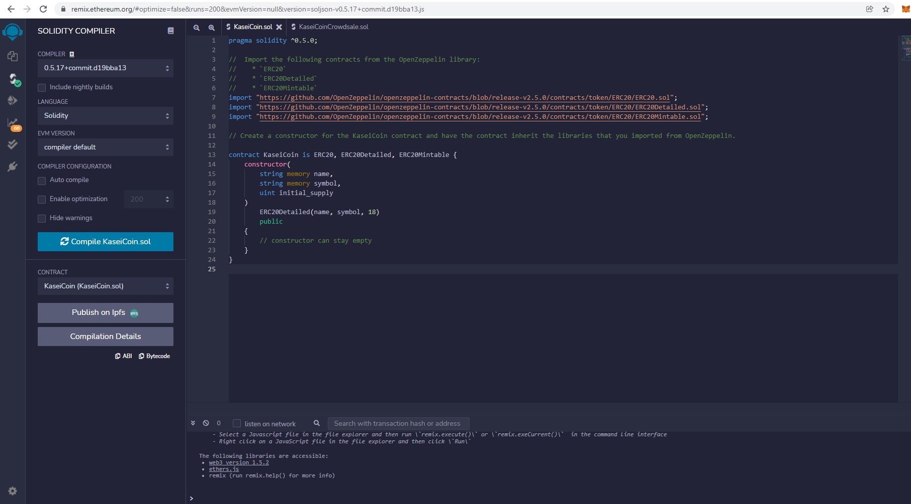
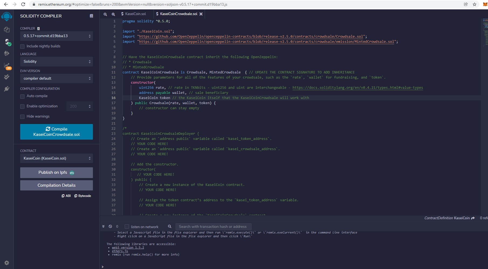
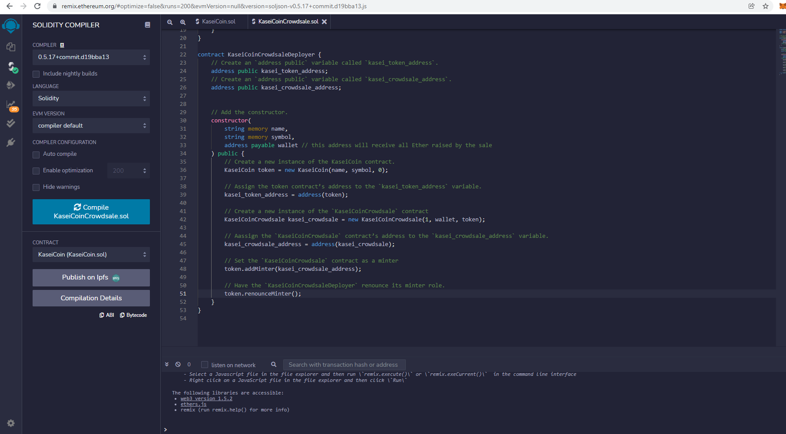
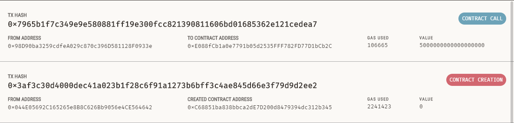
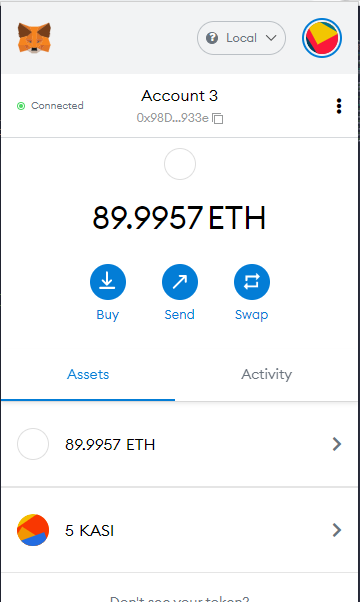

# Module 21 Challenge - Creating a Fungible Token

## Description

Creating a new, ERC-20 compliant fungible token called KaseiCoin.  This token will be launched as a crowdsale allowing users to covert test Ether to the new Kasei Coin currency. 

The sections of this project are as follows: 

* Create the KaseiCoin token contract.  
* Create the KaseiCoin crowdsale contract. 
* Create the KaseiCoin deployer contract. 
* Perform a real-world, pre-production test of the crowdsale by deploying the crowdsale to a local blockchain using Remix, MetaMask, and Ganache.
* Demonstrate the deployed contract in action.  (This demonstration is shown in the folloing README section, Evaluation Evidence.)

---

## Evaluation Evidence

The following screenshots and short videos demonstrate the compilation and successful deployment of the KaseiCoin contracts.   

1. Screenshot of the successful compilation of the `KaseiCoin` token contract.     

2. Screenshot of the successful compilation of the `KaiseCoinCrowdsale` contract.     

3. Screenshot of the successful compilation of the `KaiseCoinCrowdsaleDeployer` contract.     

4. Refer to folder `evaluation_evidence` for the following short videos demonstrating the successful deployement and use of the KaiseCoin token: 

* KaseiCoinCrowdsaleDeployer.MP4 - Deployment of KaseiCoinCrowdsaleDeployer
* KaseiCoinCrowdsale.MP4 - Deployment of KaseiCoinCrowdsale
* KaseiCoin.MP4 - Deployment of KaseiCoin
* buy_tokens_check_balance.MP4 - Tests the functionality of the crowdsale by using test accounts to buy new tokens and then checking the balances associated with those accounts.
* supply_minted_and_wei_raised.MP4 - View the total supply of minted tokens and the amount of wei that has been raised in the crowdsale contract.

5. Screenshot of the Ganache blockchain transactions used to demonstarte this contract.

5. Screenshot of Metamask wallet showing the successful purchase and reciept of the new KaseiCoins purchased in the demonstration. 

---

## Technologies

This project leverages Remix IDE to build and test smart contracts that are created in Solidity.  Using the web version of Remix IDE, there is no need to install any software. 

* [Remix IDE](https://remix.ethereum.org/) - Open source application for developing, deploying, and administering smart contracts that run in Ethereum-based blockchains.

The following packages and technologies are also used: 

* [OpenZeppelin](https://github.com/OpenZeppelin/openzeppelin-contracts) - A library used for secure smart contract development.

* [Ganache](https://trufflesuite.com/ganache/) - Easily runs a personal Ethereum blockchain which can be used to run tests, execuate commands and inspect state while controlling how the chain operates. 

* [MetaMask](https://metamask.io/) - A crypto wallet and gateway to blockchain apps. 

---
